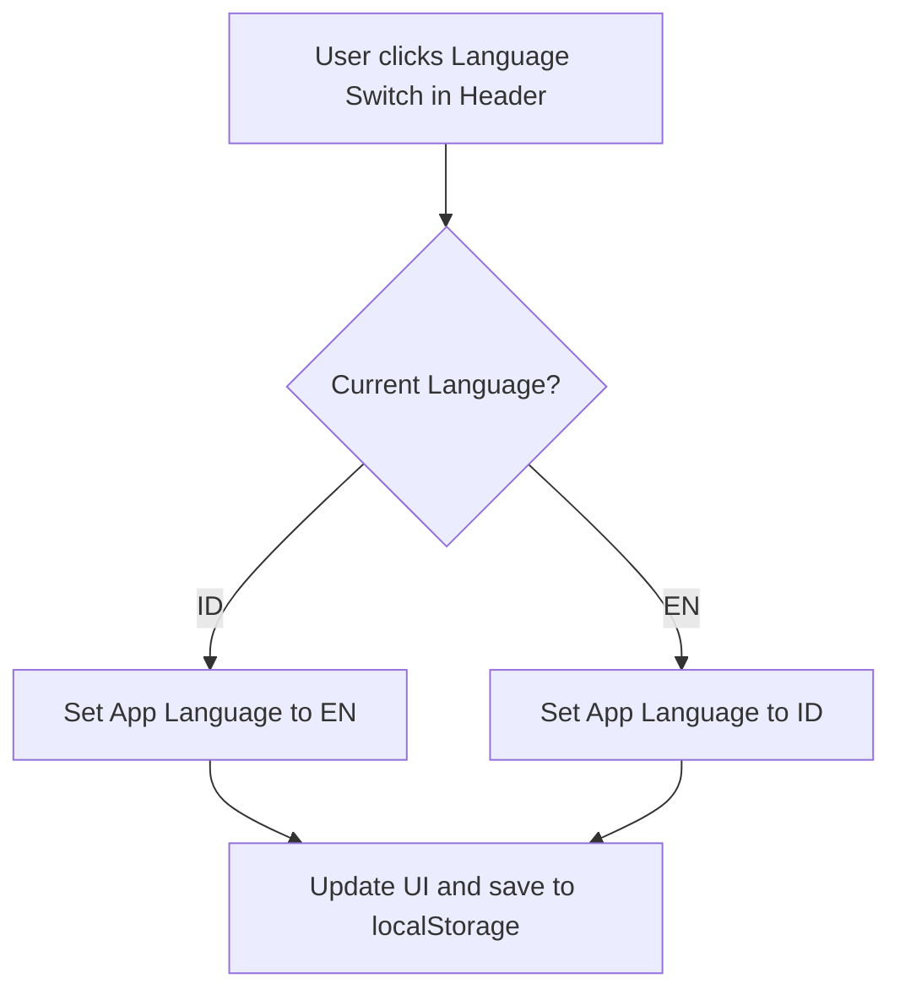

# App Navigation Architecture

## Mobile Bottom Navigation
1. **Dashboard**
   - ID: Dashboard
   - EN: Dashboard
   - Route: `/dashboard`
   - Icon: `Home`
   - Status: MVP
   - Description: Overview of recent calculations and shortcuts.
2. **Calculate**
   - ID: Hitung
   - EN: Calculate
   - Route: `/calculator`
   - Icon: `Calculator`
   - Status: MVP
   - Description: The core Quick HPP Calculator form.
3. **History**
   - ID: Riwayat
   - EN: History
   - Route: `/history`
   - Icon: `List`
   - Status: MVP
   - Description: List of saved calculations.
4. **Settings**
   - ID: Pengaturan
   - EN: Settings
   - Route: `/settings`
   - Icon: `Settings`
   - Status: MVP
   - Description: App preferences like language and currency.

## Desktop Sidebar
Contains the same MVP items as the Mobile Bottom Navigation, presented vertically on the left side of the screen.

## Future Sidebar Sections (Not MVP)
- Products/Menu
- Ingredients
- Recipes
- Reports
- AI Assistant

## Routes
- `/` : Root. Redirects based on user state.
- `/welcome` : First-time user onboarding.
- `/dashboard` : Main dashboard.
- `/calculator` : Quick HPP Calculator form.
- `/calculator/result` : Dedicated result screen (mobile).
- `/history` : Saved calculations list.
- `/history/:id` : Detail view of a saved calculation.
- `/settings` : Settings page.

## Navigation Behaviors
- **First-time User:** Root `/` redirects to `/welcome`. After onboarding, redirects to `/dashboard` or `/calculator`.
- **Returning User:** Root `/` detects `localStorage` data and redirects to `/dashboard`.
- **Mobile Navigation:** Bottom tab bar is visible on root-level routes. It hides on deeper routes like `/calculator/result` or `/history/:id` to maximize screen space (using a standard back button header instead).
- **Desktop Navigation:** Sidebar remains visible on all routes for quick jumping.
- **Header:** Contains the App logo/name on the left, and a Language Switch (ID/EN) on the right.

## Language Switch Flow

