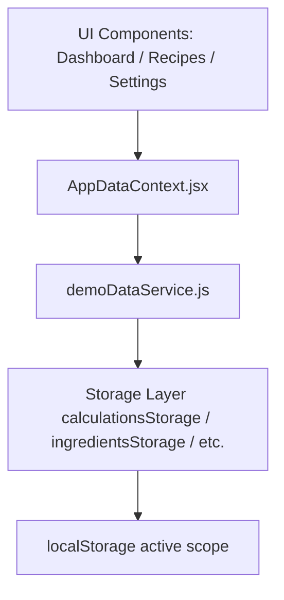

# Phase 13.7 - Centralized Demo Data System

We have cleaned up and consolidated the way Modalin manages its demo data. Previously, demo loaders were scattered across individual pages (Dashboard, Ingredients, Recipes, Products) and lacked a cohesive dependency structure (e.g., loading recipes without ingredients led to missing HPP and empty ingredient cards).

This phase establishes a centralized demo data service that manages loading/clearing demo records while fully preserving user-created workspace data.

---

## 1. Architecture Overview

### 1.1 Centralized Service (`demoDataService.js`)
All demo data loading, presence checks, and clearing logic are housed in [demoDataService.js](file:///c:/VS%20CODE%20PROJECT/hppcalculator/src/lib/demo/demoDataService.js).
It exposes:
- `loadDemoCalculationsOnly()`: Loads calculations mock.
- `loadDemoBusinessLibrary()`: Seeds Ingredients, Recipes, and Products in sequence.
- `loadCompleteDemoWorkspace()`: Seeds all mock elements (Calculations, Ingredients, Recipes, Products, Channel Profiles, Pricing Simulations).
- `clearDemoDataOnly()`: Iterates through all storage keys and filters out any item with `source === "demo"`.
- `hasDemoData()`: Query checking if any demo records exist in the current scope.
- `getDemoDataSummary()`: Returns a breakdown of demo items per module.

---

## 2. Dependency Hardening

Demo data maps dependencies sequentially:
`Ingredients -> Recipes -> Products`

- **Ingredients**: Loaded independently as they have no prerequisites.
- **Recipes**: Demo recipes depend on specific ingredient IDs (e.g., `demo-ing-1` to `demo-ing-12`).
  - If a user triggers loading demo recipes when ingredients are empty, the UI displays a warning dialog prompting the user to load the complete Demo Business Library.
- **Products**: Demo products depend on recipes.
  - If a user triggers loading demo products when recipes are empty, the UI similarly warns and prompts them to load the complete Demo Business Library.

---

## 3. Scoped Cleanups & Isolation

All demo operations are executed inside the active localStorage scope (managed by `storageScope.js`):
- When clearing demo data, the active scope is respected. Demo data in one scope (e.g., `guest`) is cleared without touching user-created data in that scope or any data in other user scopes.
- Only records with `source === "demo"` are targeted. User-created records (`source === "user"` or others) are preserved entirely.
