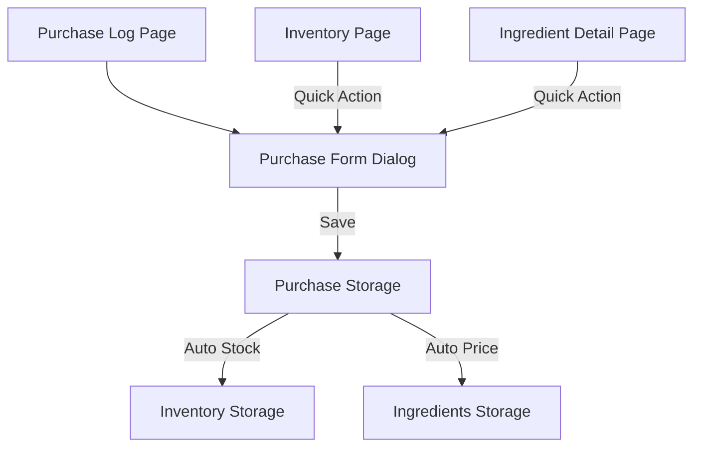

# Phase 15 - Supplier & Purchase Log Documentation

This document describes the design and implementation details of the Supplier and Purchase Log feature added in Phase 15.

## Architecture



## Data Shapes

### Supplier
```typescript
interface Supplier {
  id: string;
  name: string;
  type: "market" | "grocery" | "distributor" | "online" | "farmer" | "other";
  contactName?: string;
  phone?: string;
  email?: string;
  address?: string;
  notes?: string;
  isFavorite: boolean;
  source: "user" | "demo";
  createdAt: string;
  updatedAt: string;
}
```

### Purchase Log
```typescript
interface PurchaseLog {
  id: string;
  supplierId?: string;
  supplierNameSnapshot?: string;
  purchaseDate: string;
  invoiceNumber?: string;
  paymentMethod: "cash" | "transfer" | "qris" | "ewallet" | "debit" | "credit" | "other";
  notes?: string;
  totalAmount: number;
  source: "user" | "demo";
  createdAt: string;
  updatedAt: string;
}
```

### Purchase Item
```typescript
interface PurchaseItem {
  id: string;
  purchaseLogId: string;
  ingredientId: string;
  ingredientNameSnapshot: string;
  quantity: number;
  unit: string;
  totalPrice: number;
  unitPrice: number;
  updateIngredientPrice: boolean;
  addToStock: boolean;
  stockMovementId?: string;
  source: "user" | "demo";
  createdAt: string;
  updatedAt: string;
}
```
