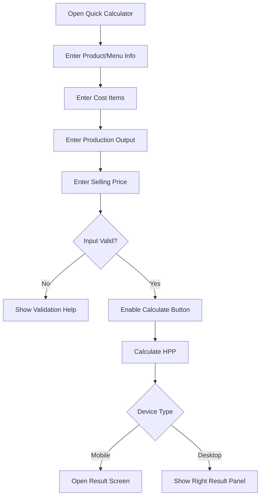
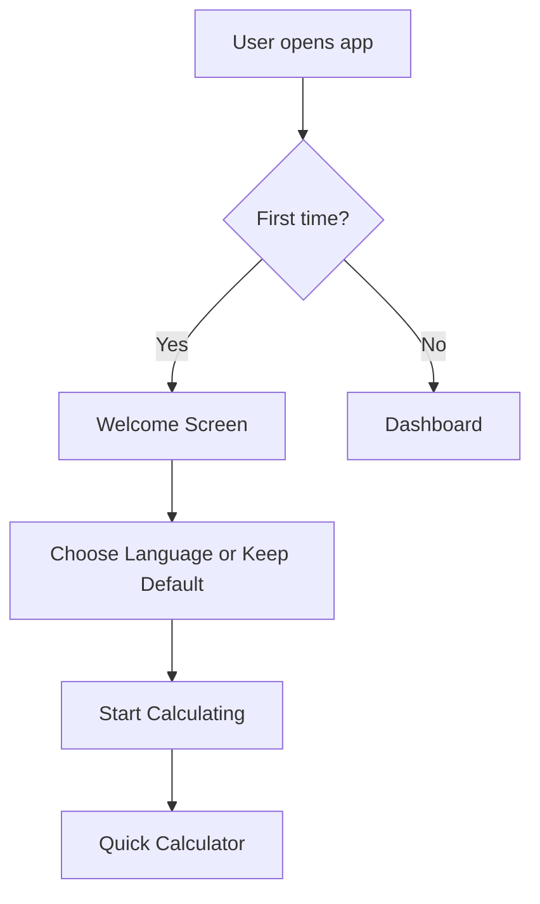

# Quick Calculator Flow

## Main Flow Diagram

## First-time vs Returning User Flow

## Mobile Behavior
- User fills out a long vertical form divided into clear cards.
- The "Hitung Sekarang" (Calculate) button is sticky at the bottom of the screen.
- On calculate, the app navigates to `/calculator/result`.
- If the user wants to adjust numbers, they tap the back arrow ("< Edit Input") which returns them to the form retaining their exact previous state.

## Desktop Behavior
- Two-column layout. Form on the left, Result Panel on the right.
- The Result Panel initially shows an empty placeholder ("Isi form untuk melihat hasil").
- Once inputs are valid and "Calculate" is clicked, the Result Panel updates live.
- No page navigation occurs on desktop; it is a seamless single-page experience.

## Form Section Details & Field UX Notes

### 1. Product Info
- **Field:** `productName`
- **Label ID:** Nama Produk / Menu
- **Label EN:** Product / Menu Name
- **Placeholder ID:** Cth: Donat Coklat Lumer
- **Placeholder EN:** e.g., Chocolate Melt Donut
- **Validation:** Required. Max 80 chars.

### 2. Cost Items
- **Field:** `costItems`
- Default rows shown: Biaya Bahan, Biaya Kemasan, Biaya Operasional.
- **Cost Name Label ID:** Nama Biaya
- **Cost Name Label EN:** Cost Name
- **Cost Amount Label ID:** Jumlah (Rp)
- **Cost Amount Label EN:** Amount
- **Add Row Behavior:** Button to "+ Tambah Biaya Lainnya". Adds an empty row.
- **Delete Row Behavior:** Trash icon next to each row. Cannot delete if it's the only row.
- **Zero Amount:** If a default row is unused, user can leave it as 0.

### 3. Production Output
- **Field:** `outputQuantity`
- **Label ID:** Jumlah Hasil Jual
- **Label EN:** Sellable Output
- **Placeholder ID:** Cth: 10
- **Validation:** Must be > 0.
- **Field:** `sellingUnit`
- **Dropdown Options:** pcs, porsi, cup, custom.
- **Field:** `failedQuantity` (Optional)
- **Label ID:** Jumlah Gagal / Dibuang
- **Label EN:** Failed / Rejected Output
- **Helper ID:** Produk rusak yang tidak bisa dijual.
- **Validation:** Must be >= 0 and < outputQuantity.

### 4. Selling Price
- **Field:** `sellingPrice`
- **Label ID:** Harga Jual (per satuan)
- **Label EN:** Selling Price (per unit)
- **Helper ID:** Harga yang akan kamu tawarkan ke pelanggan.
- **Validation:** Must be > 0.

## Calculate Button Behavior
- Disabled by default until `productName`, at least one `costItem` > 0, `outputQuantity` > 0, and `sellingPrice` > 0 are filled.
- If disabled, clicking it might show a quick toast or highlight missing fields.
- On mobile, sticky at the bottom.
- On desktop, located inside form footer and as CTA on empty result panel.
