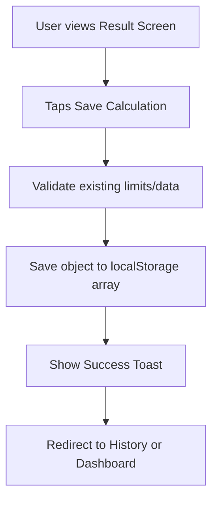

# Result Screen UX

## Result Hierarchy

**Most Important (Hero Section):**
1. **Status Badge:** Visual health indicator (Green = Good, Red = Loss).
2. **HPP per unit:** The core cost number.
3. **Profit per unit:** The pure money made per item.

**Secondary (Details Card):**
- Total production cost
- Margin percentage
- Gross revenue
- Total profit

**Tertiary:**
- Suggested safe prices.
- Conversational summary text.
- Warnings (if margin is low or rejects are high).
- Sellable quantity.

## Human-Readable Summary Templates

**ID:**
"Modal produksi kamu **Rp150.000**. Dari **50 pcs** yang bisa dijual, HPP per pcs adalah **Rp3.000**. Jika dijual **Rp5.000**, kamu untung sekitar **Rp2.000** per pcs."

**EN:**
"Your production cost is **Rp150,000**. From **50 sellable pcs**, the cost per pcs is **Rp3,000**. If sold at **Rp5,000**, your estimated profit is **Rp2,000** per pcs."

## Status Message Behavior

- **Rugi / Loss (Red):**
  - Text: "Harga jual kamu masih di bawah HPP. Produk ini berpotensi rugi."
- **Rendah / Low (Orange):**
  - Text: "Untungnya masih tipis. Hati-hati dengan biaya tambahan atau promo."
- **Cukup / Okay (Blue):**
  - Text: "Margin cukup aman, tapi masih bisa dioptimalkan."
- **Bagus / Good (Green):**
  - Text: "Margin produk ini sudah bagus untuk bisnis F&B kecil."
- **Sangat Bagus / Excellent (Gold/Purple):**
  - Text: "Margin sangat sehat. Pastikan harga tetap masuk akal untuk pelanggan."

## Suggested Price Presentation
A simple card titled "Rekomendasi Harga Jual" (Suggested Selling Price) showing three tiers:
1. **Aman (Safe - 25%):** Rp X.XXX
2. **Ideal (Ideal - 40%):** Rp X.XXX
3. **Premium (Premium - 55%):** Rp X.XXX

## Actions
- **Simpan Perhitungan (Save Calculation):** Primary CTA at the bottom. Saves to localStorage and navigates to Dashboard/History.
- **Edit Input:** Secondary CTA (or back button in header). Returns to the form.
- **Hitung Ulang (Calculate Again):** Clears the form for a new calculation.
- **Hapus Perhitungan (Delete):** Available on the detail view of a saved calculation.

## Edge Cases
- **Loss:** Emphasize HPP is higher than Price. Turn Profit number red.
- **Zero Profit:** Show warning clearly that business makes no money.
- **Low Margin:** Suggest raising price to the "Aman" tier.
- **Very Large Numbers:** Ensure text wrapping or scalable font sizes for numbers in the millions/billions.

## Save Calculation Flow

